# Snap-Share - Design Overview

## Executive Summary

Snap-Share is a self-hosted, containerized web application designed to allow event attendees to easily share photos and videos without requiring account creation. The system prioritizes simplicity for end users while providing comprehensive administrative controls for event organizers.

## System Architecture

### High-Level Architecture

```mermaid
graph TB
    Users[📱 Event Attendees<br/>Mobile/Desktop] --> LB[⚖️ Load Balancer<br/>nginx]
    Admin[👨‍💼 Event Admin<br/>Web Browser] --> LB
    
    LB --> Proxy[🌐 Nginx Proxy<br/>Port 80/443<br/>SSL Termination]
    
    Proxy --> Flask[🐍 Flask Application<br/>Port 5500<br/>Gunicorn + Supervisor]
    
    Flask --> Storage{Storage Strategy}
    
    Storage -->|Development| Local[💾 Local Filesystem<br/>/app/uploads]
    Storage -->|Production| S3[☁️ AWS S3<br/>snap-drop-uploads/]
    
    Flask --> Meta[📄 metadata.json<br/>File Attribution]
    
    subgraph "Docker Container"
        Proxy
        Flask
        Meta
        Local
    end
    
    subgraph "External Services"
        S3
    end
    
    style Users fill:#e1f5fe
    style Admin fill:#f3e5f5
    style Flask fill:#e8f5e8
    style S3 fill:#fff3e0
    style Local fill:#f1f8e9
```



### Component Stack

**Frontend Layer:**
- Pure HTML5/CSS3/JavaScript (no frameworks)
- Responsive design with mobile-first approach
- Progressive file upload with drag & drop
- Real-time upload progress indicators

**Application Layer:**
- **Flask** web framework (Python)
- **Gunicorn** WSGI server for production
- **Jinja2** templating engine
- **Werkzeug** for file handling and security

**Web Server Layer:**
- **Nginx** reverse proxy and static file serving
- SSL/TLS termination
- Request buffering for large uploads
- Rate limiting and security headers

**Storage Layer:**
- **Local filesystem** for development/small deployments
- **AWS S3** for production/scalable deployments
- **JSON metadata** for file tracking and attribution

**Container Layer:**
- **Docker** containerization
- **Supervisor** for process management
- **Docker Compose** for multi-service orchestration

## Data Architecture

### File Storage Strategy

**Local Storage:**
```
uploads/
├── {uuid}.jpg         # Actual files with UUID names
├── {uuid}.mp4
├── metadata.json      # Centralized metadata store
└── ...
```

**S3 Storage:**
```
s3://bucket-name/snap-share-uploads/
├── {uuid}.jpg
├── {uuid}.mp4
└── ...
```

### Metadata Structure

```json
{
  "id": "uuid-string",
  "original_name": "vacation_photo.jpg",
  "stored_name": "uuid.jpg",
  "upload_time": "2024-09-16T10:30:00",
  "uploader_name": "John Doe",
  "uploader_email": "john@example.com",
  "file_type": "image|video",
  "file_size": 2048576,
  "s3_url": "https://bucket.s3.region.amazonaws.com/key"
}
```

## User Experience Design

### Upload Flow

```mermaid
flowchart TD
    Start([User Opens Upload Page]) --> Form[📝 Fill Name & Email<br/>Name Required]
    
    Form --> Select[📁 Select Files<br/>Drag & Drop or Browse]
    
    Select --> Validate{File Validation}
    Validate -->|Invalid Type/Size| Error[❌ Show Error Message]
    Error --> Select
    
    Validate -->|Valid Files| Preview[👀 File Preview List<br/>Remove Individual Files]
    
    Preview --> Upload[⬆️ Click Upload Button]
    
    Upload --> Progress[📊 Progress Bar<br/>Real-time Upload Status]
    
    Progress --> Server{Server Processing}
    
    Server -->|Success| Success[✅ Upload Complete<br/>Show File Count]
    Server -->|Error| Fail[❌ Upload Failed<br/>Show Error Message]
    
    Success --> More{Upload More?}
    More -->|Yes| Select
    More -->|No| Done([End Session])
    
    Fail --> Retry{Retry?}
    Retry -->|Yes| Upload
    Retry -->|No| Done
    
    subgraph "Client Side"
        Start
        Form
        Select
        Preview
        Upload
        Progress
        Success
        Fail
        More
        Retry
        Done
    end
    
    subgraph "Server Side"
        Validate
        Server
        Error
    end
    
    style Start fill:#e3f2fd
    style Success fill:#e8f5e8
    style Error fill:#ffebee
    style Fail fill:#ffebee
```



### Admin Experience

```mermaid
flowchart TD
    AdminStart([Admin Access]) --> Login[🔐 Enter Password]
    
    Login --> Auth{Authentication}
    Auth -->|Invalid| LoginFail[❌ Access Denied]
    LoginFail --> Login
    
    Auth -->|Valid| Dashboard[📊 Admin Dashboard<br/>Statistics Overview]
    
    Dashboard --> Grid[🖼️ File Grid View<br/>Thumbnails & Metadata]
    
    Grid --> Filter[🔍 Filter Options<br/>Type/Uploader/Search]
    
    Filter --> Actions{Admin Actions}
    
    Actions --> View[👁️ View Full Size<br/>Modal Display]
    Actions --> Download[📥 Download File<br/>Original Name]
    Actions --> Delete[🗑️ Delete File]
    
    View --> Grid
    Download --> Grid
    
    Delete --> Confirm{Confirm Delete?}
    Confirm -->|No| Grid
    Confirm -->|Yes| Remove[🗑️ Remove from Storage<br/>Update Metadata]
    
    Remove --> Success[✅ File Deleted]
    Success --> Grid
    
    Grid --> Logout{Continue Admin?}
    Logout -->|Yes| Grid
    Logout -->|No| End([Session End])
    
    subgraph "Authentication Layer"
        Login
        Auth
        LoginFail
    end
    
    subgraph "File Management"
        Dashboard
        Grid
        Filter
        Actions
        View
        Download
        Delete
        Confirm
        Remove
        Success
    end
    
    style AdminStart fill:#f3e5f5
    style Dashboard fill:#e8f5e8
    style Delete fill:#ffebee
    style Success fill:#e8f5e8
    style LoginFail fill:#ffebee
```



## Technical Design Decisions

### Architecture Choices

**Flask over FastAPI:**
- Simpler for this use case
- Better templating with Jinja2
- Extensive documentation and community
- No async requirements for file uploads

**No Database:**
- JSON metadata sufficient for expected scale (< 10,000 files)
- Eliminates database setup/maintenance
- Simplifies backup and migration
- Fast search/filter for expected dataset size

**Nginx + Gunicorn:**
- Production-ready setup
- Nginx handles static files and SSL
- Gunicorn provides process management
- Supervisor ensures service reliability

**No Authentication System:**
- Event-specific use case
- Admin password is sufficient
- Reduces complexity significantly
- Users don't need accounts

### Security Considerations

**File Upload Security:**
- Whitelist allowed file extensions
- Server-side MIME type validation
- UUID-based filenames prevent conflicts
- Size limits enforced (3GB per file)

**Access Control:**
- Admin functions password-protected
- No user-level permissions needed
- Files publicly accessible once uploaded
- No sensitive data stored

**Input Validation:**
- Server-side validation for all inputs
- Secure filename handling
- Email format validation (optional field)
- XSS prevention in templates

### Performance Optimizations

**File Handling:**
- Nginx handles static file serving
- No Flask involvement in file downloads
- Request buffering for large uploads
- Client-side progress tracking

**Storage Strategy:**
- Local storage for development
- S3 for production scalability
- Metadata caching in memory
- No database queries for file serving

**Frontend Optimizations:**
- Minimal JavaScript dependencies
- CSS/JS served by Nginx
- Image thumbnails via browser rendering
- Progressive loading of file grid

## Scalability Design

### Expected Load
- **Users:** 100-500 event attendees
- **Files:** 1,000-5,000 total uploads
- **Storage:** 100-200GB total capacity
- **Concurrent uploads:** 10-20 simultaneous

### Scaling Strategies

### Horizontal Scaling

```mermaid
graph TB
    Users[👥 Event Attendees] --> LB[⚖️ Load Balancer<br/>nginx/haproxy]
    
    LB --> App1[🐳 Container 1<br/>Flask + nginx]
    LB --> App2[🐳 Container 2<br/>Flask + nginx]
    LB --> App3[🐳 Container 3<br/>Flask + nginx]
    
    App1 --> SharedS3[☁️ Shared S3 Storage<br/>snap-share-uploads/]
    App2 --> SharedS3
    App3 --> SharedS3
    
    App1 --> SharedMeta[📄 Shared Metadata<br/>Redis or Database]
    App2 --> SharedMeta
    App3 --> SharedMeta
    
    style LB fill:#e1f5fe
    style SharedS3 fill:#fff3e0
    style SharedMeta fill:#f3e5f5
```



**Vertical Scaling:**
- Increase container resources
- Multiple Gunicorn workers
- Nginx worker processes
- Memory allocation for file buffers

### Storage Scaling

**Local Storage Limitations:**
- Single server disk capacity
- No redundancy or backup
- Manual backup required

**S3 Storage Benefits:**
- Unlimited capacity
- Built-in redundancy
- Global CDN availability
- Automated backup options

## Data Flow Architecture

### Complete System Data Flow

```mermaid
sequenceDiagram
    participant U as 👤 User
    participant B as 🌐 Browser
    participant N as 🌐 Nginx
    participant F as 🐍 Flask
    participant S as 💾 Storage
    participant M as 📄 Metadata
    participant A as 👨‍💼 Admin
    
    Note over U,M: File Upload Flow
    
    U->>B: 1. Open upload page
    B->>N: 2. GET /
    N->>F: 3. Route to Flask
    F->>B: 4. Return upload.html
    B->>U: 5. Show upload form
    
    U->>B: 6. Fill form & select files
    U->>B: 7. Click upload
    B->>N: 8. POST /upload (multipart)
    N->>F: 9. Forward request
    
    F->>F: 10. Validate files
    F->>S: 11. Save files (UUID names)
    F->>M: 12. Update metadata.json
    F->>B: 13. Return success JSON
    B->>U: 14. Show success message
    
    Note over U,M: Admin Management Flow
    
    A->>B: 15. Access /admin
    B->>N: 16. GET /admin
    N->>F: 17. Route to Flask
    F->>B: 18. Return admin_login.html
    
    A->>B: 19. Enter password
    B->>N: 20. GET /admin/dashboard?password=xxx
    N->>F: 21. Validate password
    F->>M: 22. Load metadata.json
    F->>B: 23. Return dashboard with file list
    B->>A: 24. Show admin interface
    
    A->>B: 25. Click delete file
    B->>N: 26. GET /admin/delete/file-id
    N->>F: 27. Process delete request
    F->>S: 28. Remove file
    F->>M: 29. Update metadata.json
    F->>B: 30. Return success JSON
    B->>A: 31. Refresh view
    
    Note over U,M: File Viewing Flow
    
    A->>B: 32. Click view file
    B->>N: 33. GET /file/file-id
    N->>F: 34. Route to Flask
    F->>M: 35. Lookup file metadata
    F->>S: 36. Retrieve file
    F->>B: 37. Return file content
    B->>A: 38. Display file
```



## Deployment Architecture

### Production Environment

```mermaid
graph TB
    subgraph "Development Environment"
        DevMachine[💻 Developer Machine<br/>VS Code + Docker]
        DevFlask[🐍 Flask Dev Server<br/>localhost:5500]
        DevFiles[📁 Local Files<br/>./uploads/]
        
        DevMachine --> DevFlask
        DevFlask --> DevFiles
    end
    
    subgraph "Production Environment"
        Internet[🌐 Internet<br/>HTTPS Traffic]
        
        subgraph "Ubuntu VM"
            Domain[📡 upload.yourdomain.com<br/>DNS Resolution]
            
            subgraph "Nginx Layer"
                NginxHost[🌐 Host Nginx<br/>SSL Termination<br/>Port 80/443]
                Cert[🔒 Let's Encrypt<br/>SSL Certificate]
            end
            
            subgraph "Docker Container"
                NginxProxy[🌐 Container Nginx<br/>Reverse Proxy<br/>Port 80]
                Supervisor[⚙️ Supervisor<br/>Process Manager]
                Flask[🐍 Flask + Gunicorn<br/>Port 5500]
                LocalStorage[💾 Local Storage<br/>/uploads]
                Metadata[📄 metadata.json]
            end
            
            subgraph "Volumes"
                HostUploads[📁 ./uploads/<br/>Host Volume]
                HostData[📁 ./data/<br/>Host Volume]
            end
        end
        
        subgraph "External Storage"
            S3[☁️ AWS S3<br/>Optional Storage<br/>Global CDN]
        end
    end
    
    Internet --> Domain
    Domain --> NginxHost
    Cert --> NginxHost
    NginxHost --> NginxProxy
    
    NginxProxy --> Supervisor
    Supervisor --> Flask
    
    Flask --> LocalStorage
    Flask --> Metadata
    Flask -.->|Optional| S3
    
    LocalStorage --> HostUploads
    Metadata --> HostData
    
    subgraph "Scaling Options"
        LB[⚖️ Load Balancer<br/>Multiple Containers]
        CDN[🌍 CloudFront CDN<br/>Global Distribution]
    end
    
    NginxHost -.->|Future| LB
    S3 -.->|Future| CDN
    
    style DevMachine fill:#e3f2fd
    style Flask fill:#e8f5e8
    style S3 fill:#fff3e0
    style Cert fill:#f1f8e9
    style Internet fill:#fce4ec
```



### Container Design

**Single Container Approach:**
- Nginx + Flask in one container
- Supervisor manages both processes
- Simplified deployment and management
- Volume mounts for persistent storage

**Alternative Multi-Container:**
- Separate Nginx container
- Flask application container
- Shared volume for uploads
- More complex but better separation

## Configuration Management

### Environment Variables
```bash
# Core Configuration
ADMIN_PASSWORD=secure-password
USE_S3=true|false

# S3 Configuration
S3_BUCKET=bucket-name
S3_REGION=us-east-1
AWS_ACCESS_KEY_ID=key
AWS_SECRET_ACCESS_KEY=secret

# Application Tuning
MAX_CONTENT_LENGTH=3221225472  # 3GB
UPLOAD_FOLDER=/app/uploads
```

### Docker Compose Configuration
- Environment variable injection
- Volume mounting for persistence
- Port mapping for external access
- Restart policies for reliability

## Monitoring and Maintenance

### Logging Strategy
- Nginx access logs for requests
- Flask application logs for errors
- Supervisor logs for process management
- Docker container logs for debugging

### Health Monitoring
- HTTP endpoint health checks
- Disk space monitoring (local storage)
- S3 connectivity checks
- Upload success/failure rates

### Backup Strategy
- Automated metadata.json backup
- S3 cross-region replication (if using S3)
- Local storage rsync backup
- Configuration file versioning

## Risk Assessment

### Technical Risks
- **File upload failures:** Timeout handling, retry logic
- **Storage capacity:** Monitoring and alerts
- **Container crashes:** Supervisor auto-restart
- **Network issues:** Nginx proxy timeout configuration

### Security Risks
- **Malicious uploads:** File type validation, size limits
- **Admin access:** Strong password requirements
- **Data exposure:** Public file access by design
- **Storage costs:** S3 usage monitoring

### Operational Risks
- **Deployment complexity:** Simplified single-container approach
- **Backup failures:** Automated testing of backup restoration
- **Scaling bottlenecks:** S3 migration path prepared
- **Event timeline:** Thorough testing before event

## Future Enhancements

### Potential Additions
- **User galleries:** Allow uploaders to view their own files
- **Thumbnail generation:** Server-side image processing
- **Bulk download:** Admin zip download functionality
- **Email notifications:** Upload confirmation emails
- **Analytics:** Upload statistics and reporting
- **Content moderation:** Automated inappropriate content detection

### Technical Improvements
- **CDN integration:** CloudFront for S3 storage
- **Redis caching:** Metadata caching layer
- **Database migration:** PostgreSQL for larger scale
- **API endpoints:** RESTful API for mobile apps
- **Real-time updates:** WebSocket for live admin dashboard

This design balances simplicity with functionality, ensuring the system meets immediate event needs while providing a foundation for future enhancements.