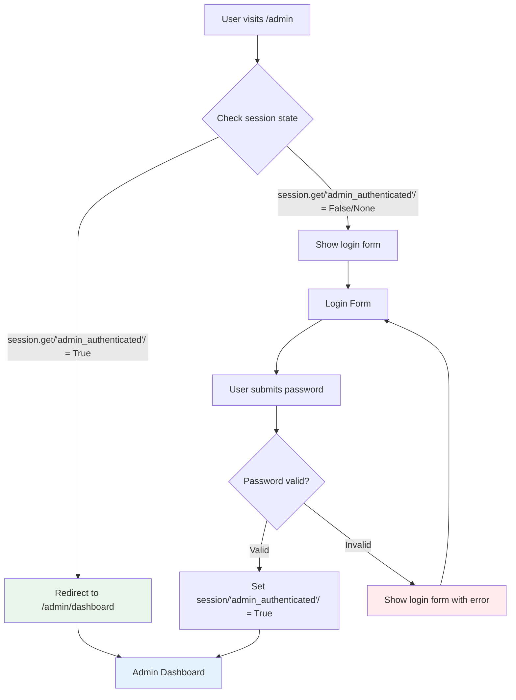

# Admin Auto-Redirect Implementation Plan
*Date: September 25, 2025*

## Executive Summary

This document outlines the implementation plan to automatically redirect already authenticated admin users from the `/admin` login page directly to the dashboard. Currently, authenticated users must manually navigate to `/admin/dashboard` even when they have valid sessions.

## Current Issue Analysis

### Problem Description
The [`/admin`](../app.py#L235) route always displays the login form, regardless of the user's authentication state. This creates poor user experience where authenticated admins see an unnecessary login screen.

### Current Code Behavior
```python
@app.route("/admin")
def admin_login():
    return render_template("admin_login.html")  # Always shows login form
```

**Location:** [`app.py:235-237`](../app.py#L235-L237)

## Implementation Flow



## Solution Design

### Technical Approach
Modify the [`admin_login()`](../app.py#L236) function to check session state before rendering the login template, using the same authentication logic as existing protected routes.

### Code Changes Required

**File:** [`app.py`](../app.py#L235)  
**Function:** [`admin_login()`](../app.py#L236)  
**Lines:** 235-237

**Current Implementation:**
```python
@app.route("/admin")
def admin_login():
    return render_template("admin_login.html")
```

**Updated Implementation:**
```python
@app.route("/admin")
def admin_login():
    # Check if admin is already authenticated
    if session.get('admin_authenticated'):
        logger.info(f"Already authenticated admin accessing /admin, redirecting to dashboard")
        return redirect(url_for('admin_dashboard'))
    
    # Show login form for unauthenticated users
    return render_template("admin_login.html")
```

## Implementation Benefits

### User Experience Improvements
- ✅ **Direct Access**: Authenticated admins go straight to dashboard
- ✅ **Reduced Friction**: No unnecessary login form for authenticated users
- ✅ **Consistent Flow**: Matches expected behavior patterns

### Technical Benefits
- ✅ **Minimal Risk**: Only 3-line code change with no security impact
- ✅ **Consistent Logic**: Uses same `session.get('admin_authenticated')` check as [`require_admin_session`](../app.py#L104) decorator
- ✅ **Existing Patterns**: Leverages standard Flask `redirect()` and `url_for()` functions
- ✅ **Enhanced Logging**: Adds tracking for redirect behavior

## Security Analysis

### Security Validation
- **No New Attack Vectors**: Change only affects user flow, not authentication mechanism
- **Same Session Check**: Uses identical validation as existing protected routes
- **Session Timeout Handling**: Expired sessions will still require re-authentication
- **Maintains Existing Security**: All current protections remain intact

### Edge Cases Handled
1. **Expired Sessions**: `session.get('admin_authenticated')` returns `False`, shows login form
2. **Invalid Sessions**: Corrupted session data fails check, shows login form
3. **First-time Users**: Users without sessions see login form normally
4. **Direct Dashboard Access**: Still protected by existing [`@require_admin_session`](../app.py#L99) decorator

## Implementation Steps

### TODO List

- [ ] **Code Modification**
  - [ ] Modify [`admin_login()`](../app.py#L236) function to check session state
  - [ ] Add session authentication check before rendering login template
  - [ ] Add redirect logic for authenticated users  
  - [ ] Add logging for redirect actions

- [ ] **Testing & Validation**
  - [ ] Test authentication flow (logged in user visits `/admin`)
  - [ ] Test normal login flow (non-logged in user visits `/admin`)
  - [ ] Verify session timeout behavior still works correctly

### Implementation Details

**Session Check Logic:**
```python
if session.get('admin_authenticated'):
```
- Returns `True` for valid authenticated sessions
- Returns `False`/`None` for unauthenticated or expired sessions
- Same logic used in existing [`require_admin_session`](../app.py#L104) decorator

**Redirect Implementation:**
```python
return redirect(url_for('admin_dashboard'))
```
- Uses same pattern as [`admin_login_handler()`](../app.py#L252) success flow
- Maintains consistent URL structure and routing

**Logging Addition:**
```python
logger.info(f"Already authenticated admin accessing /admin, redirecting to dashboard")
```
- Follows existing logging pattern (lines 243, 249, 254)
- Enables debugging and behavior tracking

## Risk Assessment

### Risk Level: **LOW**
- Single function modification
- No security implications
- Leverages existing authentication infrastructure
- Follows established codebase patterns

### Testing Requirements
- **Functional Testing**: Verify both authenticated and unauthenticated user flows
- **Session Testing**: Confirm expired sessions still require login
- **Integration Testing**: Ensure no impact on other admin routes

## Technical Specifications

**Dependencies:** None - uses existing Flask and session management  
**Database Impact:** None  
**Configuration Changes:** None  
**Performance Impact:** Negligible - single session lookup per request  
**Backwards Compatibility:** Full - existing bookmarks/links continue working  

## Success Criteria

1. ✅ Authenticated users visiting `/admin` automatically redirect to `/admin/dashboard`
2. ✅ Unauthenticated users visiting `/admin` see the login form
3. ✅ Expired sessions require re-authentication
4. ✅ All existing admin functionality remains intact
5. ✅ Logging captures redirect behavior for monitoring

---

## Implementation Summary

This implementation provides a focused solution to improve admin user experience by eliminating unnecessary login screens for authenticated users. The change is minimal, low-risk, and maintains all existing security features while following established patterns in the codebase.

**Estimated Implementation Time:** 5 minutes  
**Testing Time:** 10 minutes  
**Risk Level:** Low  
**Files Modified:** 1 ([`app.py`](../app.py#L235))