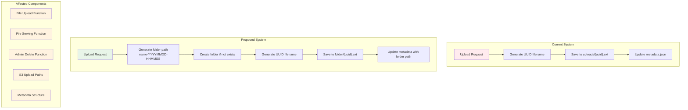
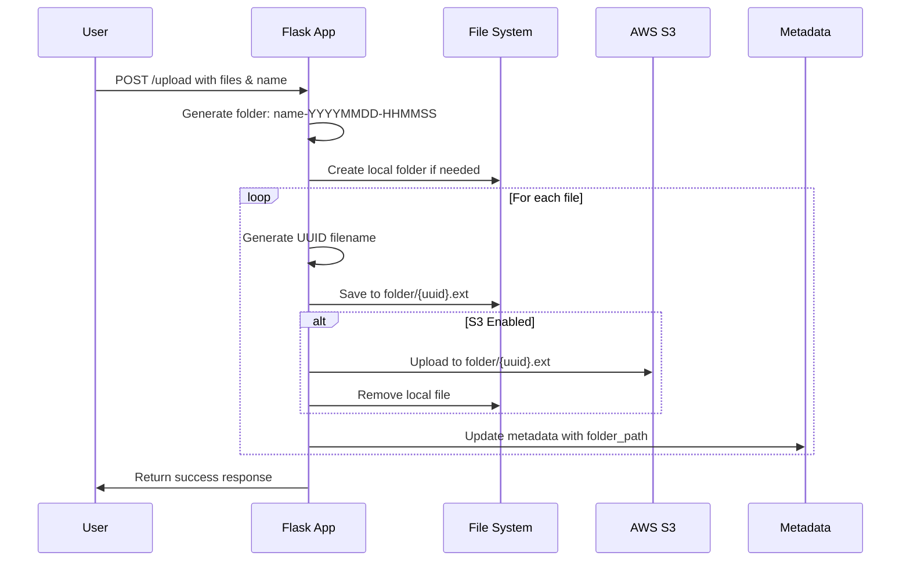
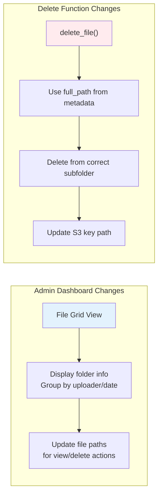

# Organized File Storage Implementation Plan

**Date:** 2025-09-25  
**Task:** Modify upload system to store files in folders by uploader name + date/timestamp  
**Format:** `uploader-name-YYYYMMDD-HHMMSS/`

## Current vs. Proposed Structure Analysis

### Current File Structure
```
uploads/
├── metadata.json
├── {uuid}.jpg
├── {uuid}.mp4
└── ...
```

### Proposed File Structure
```
uploads/
├── metadata.json
├── john-doe-20250925-143015/
│   ├── {uuid}.jpg
│   └── {uuid}.mp4
├── jane-smith-20250925-144230/
│   ├── {uuid}.png
│   └── {uuid}.mov
└── ...
```

## Architecture Impact Analysis



## Detailed Implementation Plan

### 1. Helper Functions Design

**New Function: `generate_upload_folder()`**
- Input: uploader name, upload timestamp
- Output: sanitized folder name in format `name-YYYYMMDD-HHMMSS`
- Handle special characters, spaces, and invalid filesystem characters

**New Function: `ensure_upload_directory()`**
- Create local directory if doesn't exist
- Handle both local filesystem and S3 path generation

### 2. Upload Function Modifications



### 3. Metadata Structure Changes

**Current Metadata:**
```json
{
  "id": "uuid",
  "stored_name": "uuid.ext",
  "upload_time": "2024-09-25T14:30:15",
  "uploader_name": "John Doe"
}
```

**Proposed Metadata:**
```json
{
  "id": "uuid",
  "stored_name": "uuid.ext", 
  "folder_path": "john-doe-20250925-143015",
  "full_path": "john-doe-20250925-143015/uuid.ext",
  "upload_time": "2024-09-25T14:30:15",
  "uploader_name": "John Doe"
}
```

### 4. File Serving Updates

**Current:** `serve_file()` looks in uploads root  
**Updated:** Search in `uploads/{folder_path}/{stored_name}`

### 5. S3 Path Structure

**Current S3 Key:** `snap-drop-uploads/{uuid}.ext`  
**Updated S3 Key:** `snap-drop-uploads/{folder_path}/{uuid}.ext`

### 6. Admin Functions Impact



## Implementation Steps / TODO List

### Phase 1: Core Structure Changes
- [x] Create migration script for existing files
- [x] Create helper functions for folder path generation and sanitization
- [x] Update metadata structure to include folder path information
- [x] Modify `upload_files()` function to use new folder structure

### Phase 2: File Operations Updates
- [x] Update `serve_file()` to search in subdirectories
- [x] Update `delete_file()` to use new path structure
- [x] Update S3 integration for new key patterns
- [x] Modify metadata to track folder paths

### Phase 3: Testing & Validation
- [x] Test both local and S3 storage scenarios
- [x] Test local storage functionality with new structure
- [x] Test S3 storage functionality with new structure
- [x] Validate admin dashboard file operations
- [x] Document the new folder structure

## Implementation Status: ✅ COMPLETED

All tasks have been successfully implemented and tested. The organized file storage system is now ready for use.

## Code Changes Required

### 1. New Helper Functions
```python
def generate_upload_folder(uploader_name, upload_time):
    """Generate sanitized folder name from uploader name and timestamp"""
    # Implementation needed

def ensure_upload_directory(folder_path):
    """Create directory if it doesn't exist"""
    # Implementation needed

def sanitize_folder_name(name):
    """Sanitize name for filesystem compatibility"""
    # Implementation needed
```

### 2. Functions to Modify
- `upload_files()` - Lines 159-232
- `serve_file()` - Lines 315-328  
- `delete_file()` - Lines 283-312
- `upload_to_s3()` - Lines 144-151

### 3. New Metadata Fields
- `folder_path` - relative folder path
- `full_path` - complete file path within uploads

## Migration Strategy

### Migration Script Requirements
1. **Read existing metadata.json**
2. **For each existing file:**
   - Generate appropriate folder name from uploader_name + upload_time
   - Create folder structure
   - Move file from uploads root to subfolder
   - Update metadata entry with new paths
   - Handle S3 files if applicable
3. **Update metadata.json** with new structure
4. **Backup original** metadata.json before migration

## Potential Issues & Solutions

### Issue 1: Existing Files Migration
**Problem:** Current files are in uploads root, new files will be in subdirectories

**Solution:** Create migration script to move existing files to appropriate folders based on their metadata

### Issue 2: Folder Name Conflicts
**Problem:** Multiple uploads from same user at same timestamp

**Solution:** Add milliseconds or sequence number to folder name: `name-YYYYMMDD-HHMMSS-001`

### Issue 3: Special Characters in Names
**Problem:** User names with special characters may create invalid folder names

**Solution:** Sanitize names using `secure_filename()` pattern, replace spaces with hyphens

### Issue 4: S3 Migration
**Problem:** Existing S3 files need to be moved to new key structure

**Solution:** Migration script should copy S3 objects to new keys and delete old ones

## Benefits of This Approach

1. **Better Organization:** Files grouped by uploader and time
2. **Easier Management:** Admin can navigate folder structure
3. **Batch Operations:** Process all files from one upload session together
4. **Backup Clarity:** Folder names immediately identify content source
5. **Debugging:** Easier to trace files to specific upload events
6. **Scalability:** Prevents single directory from becoming too large

## Testing Strategy

### Unit Tests
- Folder name generation and sanitization
- Directory creation logic
- Metadata updates

### Integration Tests  
- Full upload workflow with new structure
- File serving from subdirectories
- Admin delete functionality
- S3 integration with new paths

### Migration Tests
- Test migration script with sample data
- Verify backward compatibility during transition
- Test rollback procedures

## Rollback Plan

1. **Backup Strategy:** Keep original metadata.json and file structure
2. **Feature Flag:** Add environment variable to toggle new vs old structure
3. **Gradual Migration:** Support both structures during transition period
4. **Monitoring:** Log file operations to detect issues early

## Performance Considerations

### Directory Traversal
- New structure adds directory depth but improves organization
- Metadata lookups remain O(n) but files are better distributed

### S3 Costs
- No additional costs for new key structure
- Migration will involve copy operations (temporary cost increase)

### Admin Dashboard
- May need pagination or filtering for large numbers of upload folders
- Consider adding folder-based filtering options

## Security Implications

### Path Traversal Prevention
- Sanitize folder names to prevent directory traversal attacks
- Validate all path components before file operations

### Access Control
- Folder structure doesn't change access model (files remain publicly accessible)
- Admin functions still require authentication

---

*This document serves as the implementation guide for organizing file uploads into structured folders by uploader name and timestamp.*